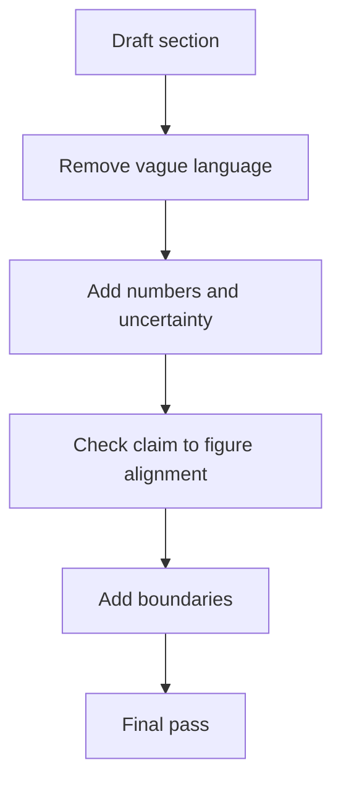

# Manuscript Revision Loop Diagram

```mermaid
flowchart TD
  A[Draft section] --> B[Remove vague language]
  B --> C[Add numbers and uncertainty]
  C --> D[Check claim to figure alignment]
  D --> E[Add boundaries]
  E --> F[Final pass]
```
